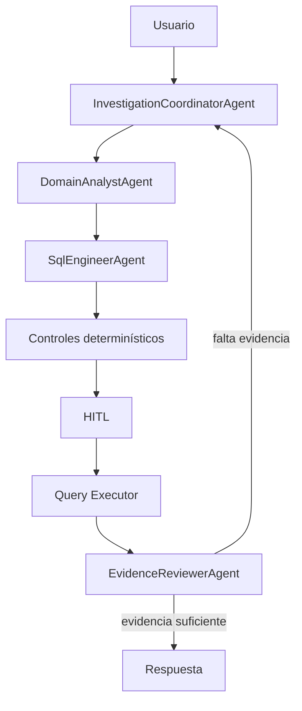

# SQL Agent

Es una **sociedad autónoma gobernada de agentes** para consultas Text-to-SQL sobre
una capa semántica publicada. La interfaz sigue implementada en **Streamlit**. El diseño visual se
inspiró en el frontend de referencia entregado, pero no se incorporó Angular ni funcionalidad ajena
al agente SQL.

# Principios arquitectónicos

## Autonomía semántica

El LLM determina la forma de la consulta desde la intención completa del usuario y el catálogo. No
se aplica una checklist universal. Fechas, filtros, agrupaciones y límites son opcionales salvo que
la solicitud o una definición semántica publicada los requiera. Las métricas certificadas conservan
su fórmula publicada; además, el agente puede crear cálculos derivados transparentes a partir de
columnas publicadas cuando el objetivo lo necesita.

## Gobernanza determinística

La autonomía no elimina los controles. Los siguientes límites permanecen fuera del LLM:

- una sola sentencia de lectura;
- fuentes y columnas publicadas en el catálogo;
- esquemas y funciones prohibidos;
- ausencia de DDL y DML;
- prohibición de joins cartesianos;
- límite máximo de filas;
- validación sintáctica y estructural con SQLGlot;
- validación de viabilidad y costo mediante PostgreSQL `EXPLAIN`;
- presupuestos por run y por tarea;
- aprobación humana antes de ejecutar;
- ejecución mediante una conexión de solo lectura;
- auditoría, hash del SQL y checkpoints persistentes.

## Estado compartido mínimo

El estado del run conserva el mensaje, SQL, snapshot AST, validaciones, HITL, evidencia y consumo.
No se utiliza un formulario de propiedades de negocio como fuente de verdad. Cada agente recibe una
proyección específica para su responsabilidad. En el SQL Engineer, la configuración predeterminada
no recorta métricas, dimensiones ni contratos de fuente publicados; solo se limitan documentos y
ejemplos redundantes para evitar repetir prosa.

## SQL como baseline de revisión

Para feedback sobre una consulta existente, las fuentes de verdad son:

1. mensaje original del usuario;
2. mensaje de revisión completo;
3. SQL anterior completo;
4. catálogo semántico relevante;
5. SQL revisado completo;
6. diff AST y validaciones posteriores.

El snapshot AST sirve para auditoría y observabilidad, no para restringir el tipo de feedback.

# Sociedad autónoma

La solución conserva cuatro identidades de razonamiento. Los perfiles de negocio son configuración
del `DomainAnalystAgent`, no clases de agente adicionales.



# Agentes y contratos

## Resumen

| Agente | Entrada | Salida | Descripción breve |
|---|---|---|---|
| `InvestigationCoordinatorAgent` | objetivo, memoria resumida, catálogo de capacidades, evidencia y presupuesto | decisiones de contexto, ruta, plan, supervisión o síntesis | Decide dinámicamente qué trabajo realizar y cuándo terminar |
| `DomainAnalystAgent` | tarea delegada, perfil de capacidad, objetivo original, catálogo y evidencia previa | pregunta refinada, foco de catálogo y evidencia esperada | Aporta contexto de dominio sin generar ni ejecutar SQL |
| `SqlEngineerAgent` | solicitud completa, catálogo, SQL anterior opcional y errores de validación | `SqlGenerationOutput` o `SqlRevisionReviewOutput` | Genera, revisa, repara y revisa SQL completo |
| `EvidenceReviewerAgent` | objetivo, SQL aprobado, snapshot, resultado y evidencia | `VerificationOutput`, crítica o explicación | Decide si la evidencia responde al objetivo y redacta la respuesta |

Los contratos incluyen `ContextResolutionOutput`, `AutonomousRoutingDecision`,
`SqlGenerationOutput`, `SqlRevisionReviewOutput`, `SecurityValidation` y `CostValidation`.

Los JSON Schema vigentes están disponibles en:

```http
GET /api/v1/models/society-contracts
GET /api/v1/models/agent-skills
GET /api/v1/models/sql-artifact-contracts
```

## InvestigationCoordinatorAgent

### Personalidad

Coordinador empresarial calmado, orientado al objetivo y a la mínima investigación suficiente.

### Modos

```text
context
route
plan
supervise
synthesize
conversation
```

### Entrada conceptual

```json
{
  "question": "Compara aprobación y contracargos por canal",
  "memory_summary": {},
  "published_domains": [],
  "specialist_capabilities": [],
  "evidence_summary": [],
  "governed_budget": {}
}
```

### Salida conceptual

```json
{
  "mode": "plan",
  "tasks": [
    {
      "objective": "Obtener aprobación por canal",
      "capability": "payment-authorization"
    },
    {
      "objective": "Obtener contracargos por canal",
      "capability": "chargeback-analysis"
    }
  ],
  "completion_criteria": [
    "Ambas evidencias usan periodos comparables"
  ]
}
```

### Cómo se integra

El workflow lo invoca al inicio de cada turno y después de una crítica que solicite
replanificación. No existe un endpoint público para invocarlo sin gobernanza.

### Limitaciones

No genera SQL, no ejecuta herramientas y no puede alterar seguridad, costos, permisos, HITL o
presupuestos.

## DomainAnalystAgent

### Personalidad

Analista preciso del dominio seleccionado. Los perfiles actuales se cargan desde
`config/specialists.yaml`.

### Entrada conceptual

```json
{
  "task": {
    "task_id": "task-1",
    "objective": "Obtener rechazos por canal"
  },
  "profile": {
    "role": "acquiring",
    "capabilities": ["transaction-analysis"]
  },
  "original_question": "Analiza los rechazos por canal",
  "published_domains": [],
  "prior_evidence": []
}
```

### Salida conceptual

```json
{
  "task_id": "task-1",
  "specialist": "acquiring",
  "refined_question": "Agrupa las transacciones rechazadas por canal",
  "domain": "acquiring",
  "expected_evidence": ["conteo por canal"],
  "catalog_focus": ["transacciones", "canal", "estado"],
  "can_proceed": true
}
```

### Cómo se integra

El coordinador delega por capacidades. Agregar un perfil no exige una nueva clase Python.

### Limitaciones

No ejecuta SQL, no aprueba controles y no puede utilizar fuentes fuera del perfil y catálogo.

## SqlEngineerAgent

### Personalidad

Ingeniero SQL senior que interpreta lenguaje natural usando el catálogo completo relevante y, para
revisiones, el SQL anterior completo.

### Modos

```text
generate
revise
repair
review_revision
```

### Input de generación

```json
{
  "mode": "generate",
  "question": "Dame las 20 últimas transacciones",
  "semantic_context": {
    "allowed_sources": ["semantic.v_payment_transactions"],
    "source_contracts": {}
  }
}
```

### Input de revisión abierta

```json
{
  "mode": "revise",
  "question": "Dame las transacciones reversadas",
  "raw_user_message": "quita amount_pen y coloca channel antes que city",
  "previous_sql": "SELECT transaction_id, amount_pen, city, channel FROM ...",
  "semantic_context": {
    "allowed_sources": ["semantic.v_payment_transactions"],
    "source_contracts": {}
  }
}
```

### Output

```json
{
  "sql": "SELECT transaction_id, channel, city FROM ...",
  "interpretation": "Transacciones sin amount_pen y con channel antes que city",
  "assumptions": [],
  "change_summary": [
    "Se eliminó amount_pen",
    "Se movió channel antes de city"
  ],
  "requires_clarification": false,
  "clarification_question": null
}
```

La salida del LLM no contiene objetos abiertos de validación. `CompiledSqlArtifact`, hash, snapshot
y validaciones son construidos posteriormente por código determinístico.

### Cómo se integra

El workflow lo invoca después de explorar el catálogo, al recibir cambios HITL o cuando un
validador devuelve errores reparables.

### Limitaciones

No ejecuta SQL, no usa fuentes no publicadas y no puede omitir ningún control.

## EvidenceReviewerAgent

### Personalidad

Revisor escéptico y orientado a evidencia.

### Entrada conceptual

```json
{
  "mode": "verify",
  "question": "Dame las 20 últimas transacciones",
  "sql": "SELECT ... ORDER BY transaction_timestamp DESC LIMIT 20",
  "sql_snapshot": {},
  "result": {
    "row_count": 20,
    "columns": ["transaction_id", "transaction_timestamp"],
    "rows": []
  }
}
```

### Salida conceptual

```json
{
  "mode": "verify",
  "valid": true,
  "ready_to_finalize": true,
  "missing_evidence": [],
  "contradictions": [],
  "findings": []
}
```

### Cómo se integra

El workflow lo invoca solo después de obtener resultados o al evaluar evidencia acumulada.

### Limitaciones

No genera ni ejecuta SQL y no puede cambiar una decisión de seguridad, costo o HITL.

# Tools y servicios determinísticos

| Tool | Entrada | Salida | Descripción breve |
|---|---|---|---|
| `SemanticCatalogTool` | texto y dominio opcional | fuentes, columnas, relaciones y definiciones publicadas | Recupera el contexto semántico permitido |
| `SqlArtifactService` | SQL completo | `SqlSnapshot` y `CompiledSqlArtifact` | Crea metadata estructural genérica desde el AST |
| `SqlRevisionDiffAnalyzer` | SQL anterior y SQL revisado | diff AST genérico | Detecta cualquier cambio estructural sin taxonomía de feedback |
| `SqlSecurityValidator` | SQL, allowlist y contratos de fuente | `SecurityValidation` | Impide escritura, fuentes/columnas no autorizadas y joins inseguros |
| `QueryEngine` | SQL validado | `CostValidation` o `QueryResult` | Ejecuta `EXPLAIN` y luego la consulta de solo lectura |
| `TaskBudgetPolicy` | consumo y límites | decisión de presupuesto | Evita ciclos y consumo sin límite |
| `RunExecutionCoordinator` | run y lease | control de concurrencia | Garantiza idempotencia, heartbeat y reanudación |
| `ConversationMemoryService` | respuesta y estado | memoria resumida | Conserva el último SQL válido y evidencia útil |

# SQLSnapshot y CompiledSqlArtifact

`SqlSnapshot` es genérico y deriva de SQLGlot:

```json
{
  "schema_version": "2.0",
  "dialect": "postgres",
  "statement_type": "SELECT",
  "sources": ["semantic.v_payment_transactions"],
  "projections": ["transaction_id", "channel", "city"],
  "predicates": ["status = 'REVERSED'"],
  "group_by": [],
  "having": null,
  "order_by": ["transaction_timestamp DESC"],
  "limit": 20,
  "distinct": false,
  "ctes": []
}
```
# Revisión SQL genérica

Ante un feedback el agente recibe el mensaje y SQL completos. Devuelve otro SQL completo. El sistema no necesita
crear propiedades nuevas para cada columna, filtro u operador. Después:

1. SQLGlot calcula el diff estructural;
2. un revisor LLM contrasta el mensaje contra ambos SQL;
3. el catálogo valida fuentes, columnas y valores publicados;
4. seguridad y costo se evalúan;
5. el usuario recibe el SQL para HITL.

Una aclaración se solicita únicamente cuando persisten dos resultados empresariales materialmente
diferentes y el catálogo/contexto no permite resolverlos.

# Memoria y estado compartido

## Checkpoints del run

LangGraph persiste el estado detallado en PostgreSQL mediante `AsyncPostgresSaver`. Incluye SQL,
snapshot, validaciones, presupuesto, HITL, resultado y evidencia.

## Memoria de sesión

`app.session_memory` conserva un resumen de la última consulta válida para futuros turnos. Una
revisión fallida no elimina el último SQL aprobado.

## Mensajes

`app.chat_messages` conserva los mensajes visibles y payloads estructurados para trazabilidad.

## Redis

Redis se usa como caché y coordinación temporal. PostgreSQL sigue siendo la fuente persistente.

# Uso total de tokens por sesión

Además del consumo mostrado en cada consulta, la API agrega el consumo de todos los runs de la
sesión:

```http
GET /api/v1/sessions/{session_id}/usage
```

Respuesta:

```json
{
  "runs": 6,
  "llm_calls": 18,
  "input_tokens": 24320,
  "output_tokens": 5180,
  "total_tokens": 29500,
  "cached_input_tokens": 3100,
  "reasoning_output_tokens": 840
}
```

Streamlit muestra el total en la cabecera, en cada conversación de la barra lateral y en la sección
**Uso total de tokens de la sesión**. Guardar o agregar estos valores en PostgreSQL no consume
tokens; los tokens solo se consumen cuando se llama a un proveedor LLM.

# Interfaz Streamlit

La interfaz permanece en:

```text
streamlit_app/
├── app.py
├── api_client.py
└── assets/
```

# API principal

```http
POST   /api/v1/auth/login
POST   /api/v1/sessions
GET    /api/v1/sessions
PATCH  /api/v1/sessions/{session_id}
DELETE /api/v1/sessions/{session_id}
GET    /api/v1/sessions/{session_id}/messages
GET    /api/v1/sessions/{session_id}/usage
POST   /api/v1/agent/runs
POST   /api/v1/agent/runs/stream
GET    /api/v1/agent/runs/{run_id}
POST   /api/v1/agent/runs/{run_id}/feedback
GET    /api/v1/models/society-contracts
GET    /api/v1/models/agent-skills
GET    /api/v1/models/sql-artifact-contracts
```

# Ejemplos de consultas para el agente

1. `Dame las 20 últimas transacciones ejecutadas.`
2. `Muestra las transacciones rechazadas con comercio y código de respuesta.`
3. `Compara la facturación mensual por marca de tarjeta.`
4. `Agrupa los contracargos por motivo y canal.`
5. `Lista los comercios con mayor cantidad de fallas de liquidación.`
6. `Calcula la tasa de aprobación por canal.`
7. `Muestra el importe procesado por ciudad y esquema de tarjeta.`
8. `Compara dos periodos usando las fechas que correspondan al objetivo.`
9. `Quita amount_pen de la consulta anterior y mueve channel antes de city.`
10. `Agrega un filtro por las ciudades Lima y Arequipa sin cambiar el resto.`
11. `Cambia la métrica del ranking y actualiza el ordenamiento dependiente.`
12. `Incluye una CTE para separar el cálculo base de la presentación final.`

# Configuración de contexto semántico

La proyección limita documentos narrativos y ejemplos repetidos, pero por defecto conserva **todos**
los contratos de fuente, métricas y dimensiones publicados para el dominio. De esta manera, una
nueva columna, filtro, fecha, valor o medida del catálogo no requiere modificar el código.

```dotenv
SEMANTIC_CONTEXT_MAX_DOCUMENTS=4
SEMANTIC_CONTEXT_MAX_EXAMPLES=1
SEMANTIC_CONTEXT_MAX_METRICS=0
SEMANTIC_CONTEXT_MAX_DIMENSIONS=0
SEMANTIC_CONTEXT_MAX_SOURCE_CONTRACTS=0
```

El valor `0` significa «sin límite por cantidad» para métricas, dimensiones y contratos de fuente.
Puede establecerse un valor positivo como optimización explícita en instalaciones con catálogos muy
grandes, aceptando que esa configuración reduce el contexto visible en una llamada. Los controles
de tokens, caché y salida continúan aplicándose por rol y modo.

# Configuración

Genera un `.env` local con secretos aleatorios y cadenas de conexión consistentes. Si el
archivo ya existe, el mismo comando conserva sus valores no vacíos y completa los campos faltantes:

```bash
python scripts/generate_local_env.py
python scripts/validate_env.py
```

Por tanto, para corregir un `.env` creado mediante `cp .env.example .env` y que todavía tenga
`DATABASE_URL=` en blanco, no es necesario eliminarlo ni perder `OPENAI_API_KEY`: ejecuta los dos
comandos anteriores.

El archivo `.env.example` funciona como contrato de configuración y no contiene contraseñas
reutilizables. Puede copiarse manualmente, pero antes de Docker deben completarse como mínimo:

```dotenv
APP_SECRET_KEY=<mínimo 32 caracteres aleatorios>
BOOTSTRAP_USERNAME=admin
BOOTSTRAP_PASSWORD=<mínimo 12 caracteres>
BOOTSTRAP_ROLES=["admin","analyst"]
BOOTSTRAP_SYNC_CREDENTIALS=true
INTERNAL_SERVICE_KEY=<mínimo 24 caracteres aleatorios>
POSTGRES_PASSWORD=<secreto>
AGENT_READER_PASSWORD=<secreto>
DATABASE_URL=postgresql+psycopg://<owner>:<password>@postgres:5432/axiz_agent_control
CHECKPOINT_DATABASE_URL=postgresql://<owner>:<password>@postgres:5432/axiz_agent_control
AGENT_DATABASE_URL=postgresql://<reader>:<password>@postgres:5432/axiz_business_data
REDIS_URL=redis://redis:6379/0
CORS_ORIGINS=["http://localhost:8501"]
```

## Autoscroll del chat

```dotenv
STREAMLIT_AUTO_SCROLL_ENABLED=true
STREAMLIT_AUTO_SCROLL_BEHAVIOR=auto
STREAMLIT_AUTO_SCROLL_DEBOUNCE_MS=40
STREAMLIT_AUTO_SCROLL_SETTLE_DELAYS_MS=[0,75,180,400,800]
```

El observador permanece activo mientras se genera la respuesta y reubica el viewport al final ante
nuevos mensajes o actualizaciones SSE. `auto` es el modo recomendado para evitar que animaciones
acumuladas queden retrasadas durante respuestas largas.

Modelos de los cuatro agentes:

```dotenv
AXIZ_INVESTIGATION_COORDINATOR_MODEL_PRESET=openai_gpt_5_6_terra_balanced
AXIZ_DOMAIN_ANALYST_MODEL_PRESET=openai_gpt_5_6_luna_routing
AXIZ_SQL_ENGINEER_MODEL_PRESET=openai_gpt_5_6_terra_sql
AXIZ_EVIDENCE_REVIEWER_MODEL_PRESET=openai_gpt_5_6_luna_explanation
```

Agrega las credenciales del proveedor seleccionado. Por ejemplo:

```dotenv
OPENAI_API_KEY=...
```

# Base integrada y base externa

## PoC integrada

```dotenv
BUSINESS_DATA_MODE=embedded
```

No se requiere ninguna base externa. Docker Compose levanta datos de ejemplo y vistas semánticas.

## Producción con capa semántica externa

```dotenv
BUSINESS_DATA_MODE=external
AGENT_DATABASE_URL=postgresql://<readonly-user>:<password>@<host>:<port>/<semantic-database>
```

La cuenta debe ser de solo lectura y los objetos deben estar publicados en el catálogo del
proyecto.

# Despliegue

Primero crea o repara y valida `.env`:

```bash
python scripts/generate_local_env.py
python scripts/validate_env.py
```

Después ejecuta Docker Compose:

```bash
docker compose \
  --env-file .env \
  -f infrastructure/docker-compose.yml \
  down

docker compose \
  --env-file .env \
  -f infrastructure/docker-compose.yml \
  build --no-cache api streamlit

docker compose \
  --env-file .env \
  -f infrastructure/docker-compose.yml \
  up -d
```

URLs definidas por `*_HOST_PORT` en `.env`:

```text
Streamlit: http://localhost:8501
API:       http://localhost:8000
OpenAPI:   http://localhost:8000/docs
```

# Estructura

```text
src/axiz/pe/sql_agent/
├── agents/
│   ├── investigation_coordinator_agent.py
│   ├── domain_analyst_agent.py
│   ├── sql_engineer_agent.py
│   └── evidence_reviewer_agent.py
├── skills/
│   ├── coordinator/
│   ├── sql/
│   └── evidence/
├── models/
│   ├── contracts.py
│   ├── society.py
│   ├── sql_artifacts.py
│   └── state.py
├── services/
│   ├── sql_artifacts.py
│   ├── conversation_memory.py
│   └── llm_usage.py
├── tools/
│   ├── sql_ast_analyzer.py
│   ├── sql_revision_diff.py
│   ├── sql_security.py
│   └── semantic_catalog.py
└── workflow/
    ├── graph.py
    ├── nodes.py
    └── subgraphs/
```

